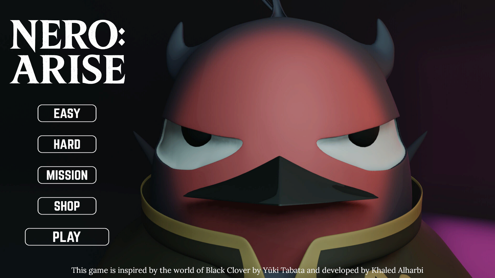
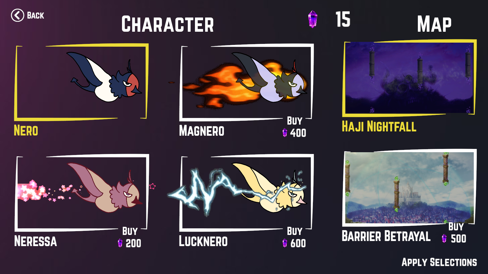
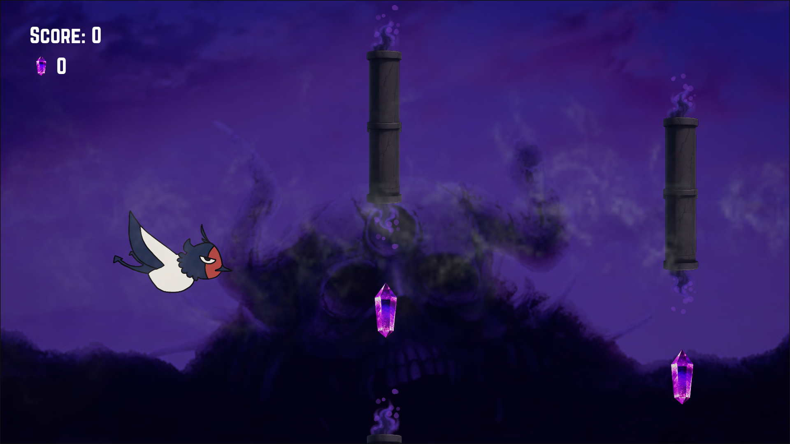
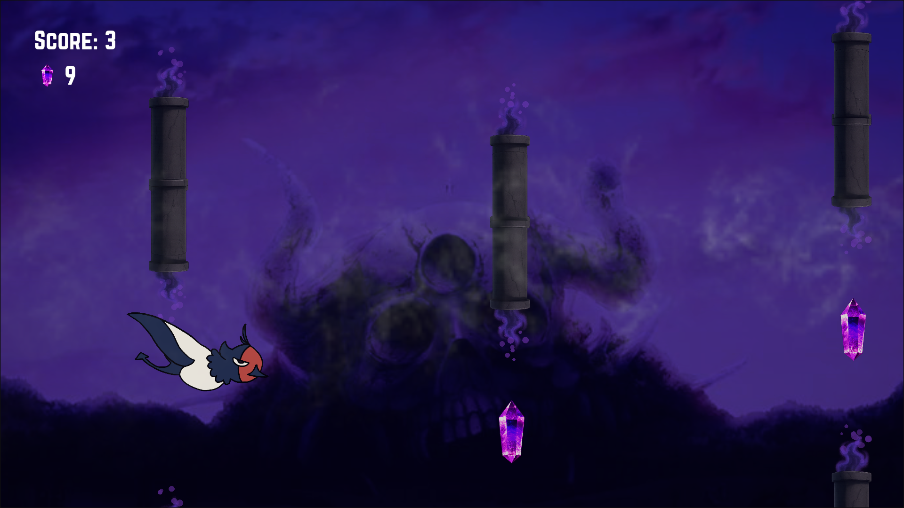
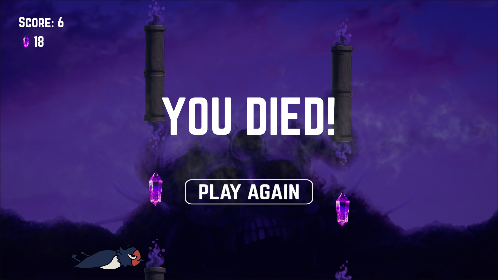

# 🎮 NERO: ARISE  
*By Khaled Alharbi*  

**Live Game:** [▶ Play NERO: ARISE](https://khaled-harbi.github.io/NERO-ARISE/)  

> *A Black Clover themed arcade adventure where skill timing and anime vibes collide*  

---

## 📖 Overview  
**NERO: ARISE** is a **Flappy Bird inspired** arcade game set in the magical universe of *Black Clover* by Yūki Tabata.  
You control **Nero**, the mysterious bird, navigating through mystical landscapes, dodging magical obstacles, and chasing high scores.  

Built with Unity and deployed via WebGL, it blends **anime fan service** with **addictive, quick-replay gameplay** for both fans and casual players.  

---

## 🎯 Purpose  
The goal of NERO: ARISE is to transform a simple mechanic into a **creative, anime-themed experience** that appeals to:  
- Fans of *Black Clover*  
- Anime enthusiasts  
- Casual gamers who enjoy quick, replayable challenges  

---

## 🕹 Game Features  

### Core Gameplay
- **Tap to Fly** — keep Nero in the air while avoiding obstacles.  
- **Obstacle Avoidance** — magical pipes inspired by the anime.  
- **Three Game Modes**:  
  - **Easy** — slow pace, win after 20 pipes.  
  - **Hard** — faster pace, win after 40 pipes.  
  - **Mission** — survive 60 seconds at medium speed.  

### Game Over Conditions
- Hitting obstacles.  
- Flying too high or too low.  

---

## 👤 Playable Character  
**Nero** — the mysterious bird from *Black Clover*, chosen for her natural fit with flying mechanics.  

**Customization**: Unlock skins inspired by other characters from *Black Clover*.  

---

## 🌆 Visuals & Environment  
- Levels based on **key Black Clover locations**.  
- Magical obstacle effects.  
- Vibrant anime-style visuals.  

---

## 🏆 Rewards & Progression  
- **Milestone Trophies**:  
  - 10 pipes → Silver Clover Cup  
  - 20 pipes → Gold Clover Cup  
  - 30 pipes → Red Clover Cup  
- **Mana Stones**: Collect to unlock characters and maps via the shop.  

---

## 📷 Screenshots  

  
  

  
  

  

---

## 🚀 Future Plans  
- New game modes.  
- More characters & maps.  
- Daily missions and quests.  

---

## 🛠 Tech Stack  
- **Engine:** Unity (WebGL Build)  
- **Language:** C#  
- **Hosting:** GitHub Pages
  
---

## 📜 Credits  
- Game developed by **Khaled Alharbi**  
- Inspired by *Black Clover* by **Yūki Tabata**
